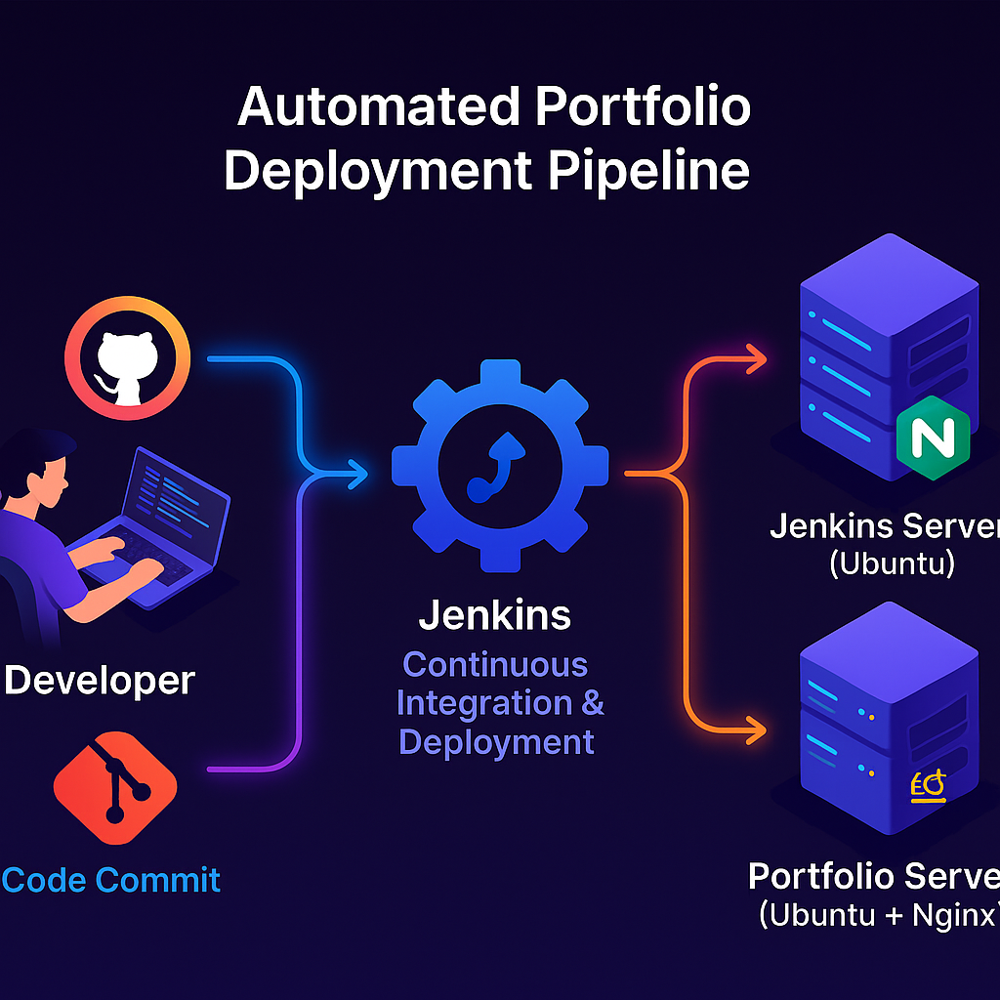

# 🌐 Mahesh Shelke – DevOps Portfolio CI/CD Deployment

### 🚀 Overview  
This project demonstrates **complete CI/CD automation** of a personal **Portfolio Website** using **Git, GitHub, Jenkins, AWS EC2, and Nginx**.  
The main goal of this project is to host a static portfolio webpage automatically on an EC2 instance whenever new code is pushed to GitHub.  

---
## ⚡ Architecture Diagram  



---

## 🧩 Tech Stack  

| Tool | Purpose |
|------|----------|
| **Git** | Version control system to track code changes |
| **GitHub** | Remote repository to store and manage project code |
| **Jenkins** | CI/CD automation tool for continuous integration and deployment |
| **AWS EC2 (Ubuntu)** | Cloud instance used as Jenkins server and portfolio hosting server |
| **Nginx** | Web server for hosting portfolio site |
| **SSH Keys** | Secure authentication between Jenkins and EC2 deployment server |

---

## ⚙️ Project Workflow – Step by Step Explanation  

### 🧱 **1. Project Development (Local System)**  
- Created a static **portfolio website** using HTML, CSS, and images.  
- Verified it locally using VS Code Live Server.  
- Folder structure:
  ```
  /maheshportfolio
  ├── index.html
  ├── img/
  └── Jenkinsfile
  ```

---

### 🧰 **2. Initialize Git and Push Code to GitHub**
Used Git to version control and push code to GitHub.  
Commands used:

```bash
git init
git add .
git commit -m "Initial portfolio upload"
git branch -M main
git remote add origin https://github.com/Maheshshelke05/maheshportfolio-.git
git push -u origin main
```

✅ After this, the full project (HTML, CSS, images, Jenkinsfile) was available publicly on GitHub:  
👉 [GitHub Repository](https://github.com/Maheshshelke05/maheshportfolio-)

---

### ⚙️ **3. Setup Jenkins on Ubuntu EC2 (Server 1)**
1. Installed Jenkins on Ubuntu EC2:  
   ```bash
   sudo hostnamectl hostname jenkins
   sudo hostname jenkins
   exit
   sudo apt update
   sudo apt install openjdk-17-jdk -y
   wget -q -O - https://pkg.jenkins.io/debian/jenkins.io.key | sudo apt-key add -
   sudo sh -c 'echo deb http://pkg.jenkins.io/debian/ stable main > /etc/apt/sources.list.d/jenkins.list'
   sudo apt update
   sudo apt install jenkins -y
   sudo systemctl start jenkins
   sudo systemctl enable jenkins
   ```

2. Access Jenkins via:  
   👉 `http://<Jenkins-Server-Public-IP>:8080`

3. Installed Plugins:
   - Git Plugin  
   - SSH Agent Plugin  

4. Added SSH credentials to connect Jenkins → Portfolio EC2:  
   - ID: `jenkinskey`  
   - Username: `ubuntu`  
   - Private Key: pasted from `.pem` file  

---

### 🖥️ **4. Setup Portfolio EC2 (Server 2)**  
1. Launched a separate Ubuntu EC2 instance named **portfolio my**.  
2. Opened inbound port **80 (HTTP)** in AWS Security Group for Nginx.  
3. No manual Nginx install needed — Jenkins pipeline handles this automatically.

---

### 🔁 **5. Jenkins Pipeline Configuration**
In Jenkins Dashboard:  
- Created new Pipeline Project → `portfolio-deploy`  
- Selected “Pipeline Script from SCM”  
- SCM: Git  
- Repo URL: `https://github.com/Maheshshelke05/maheshportfolio-.git`  
- Branch: `main`  
- Script Path: `Jenkinsfile`  

---

## 🧾 Jenkinsfile (CI/CD Pipeline Script)

```groovy
pipeline {
    agent any

    environment {
        DEPLOY_USER = 'ubuntu'
        DEPLOY_HOST = '3.111.30.169'             // EC2 (Portfolio Server)
        DEPLOY_PATH = '/var/www/html'
        SSH_CREDENTIALS_ID = 'jenkinskey'       // Jenkins Credential ID
        REPO_URL = 'https://github.com/Maheshshelke05/maheshportfolio-.git'
        BRANCH = 'main'
    }

    stages {
        stage('Checkout Code') {
            steps {
                echo '📦 Checking out portfolio code from GitHub...'
                git branch: "${BRANCH}", url: "${REPO_URL}"
            }
        }

        stage('Prepare Deployment Server') {
            steps {
                echo '⚙️ Installing Nginx and preparing deployment path...'
                sshagent (credentials: ["${SSH_CREDENTIALS_ID}"]) {
                    sh '''ssh -o StrictHostKeyChecking=no ${DEPLOY_USER}@${DEPLOY_HOST} "
                        sudo apt update -y &&
                        sudo apt install nginx -y &&
                        sudo systemctl enable nginx &&
                        sudo systemctl start nginx &&
                        sudo rm -rf ${DEPLOY_PATH}/*"
                    '''
                }
            }
        }

        stage('Deploy Portfolio') {
            steps {
                echo '🚀 Deploying portfolio to EC2...'
                sshagent (credentials: ["${SSH_CREDENTIALS_ID}"]) {
                    sh '''scp -o StrictHostKeyChecking=no -r * ${DEPLOY_USER}@${DEPLOY_HOST}:${DEPLOY_PATH}/
                    ssh -o StrictHostKeyChecking=no ${DEPLOY_USER}@${DEPLOY_HOST} "
                        sudo chown -R www-data:www-data ${DEPLOY_PATH} &&
                        sudo systemctl restart nginx"
                    '''
                }
            }
        }
    }

    post {
        success {
            echo '✅ Deployment Successful! Portfolio live on Nginx server.'
        }
        failure {
            echo '❌ Deployment Failed. Check Jenkins logs for details.'
        }
    }
}
```

---

## 🌍 Live Deployment  
**Public URL:** [http://3.111.30.169](http://3.111.30.169)  
✅ Hosted on AWS EC2 (Ubuntu) using Nginx  

---

## 📸 Screenshots  

| Screenshot | Description |
|-------------|-------------|
|  | Deployed portfolio website (hosted via Nginx) |
|  | Portfolio code stored on GitHub |
|  | AWS EC2 instances for Jenkins & portfolio |
|  | Jenkins pipeline console output |
|  | Jenkins dashboard showing successful builds |
|  | SSH credentials setup in Jenkins |
|  | Jenkinsfile configured locally and pushed to GitHub |

---

## ✅ Key Highlights  

- Fully automated CI/CD using Jenkins  
- No manual deployment needed — push code → site updates automatically  
- Static portfolio hosted securely using Nginx  
- Two separate AWS EC2 instances for Jenkins and deployment server  
- Clean, reliable, and production-ready setup  

---

## 👨‍💻 Author  

**Mahesh Shelke**  
AWS & DevOps Engineer  
💼 [GitHub Profile](https://github.com/Maheshshelke05)  

---

### ⭐ _If you found this helpful, don’t forget to star the repo!_  
